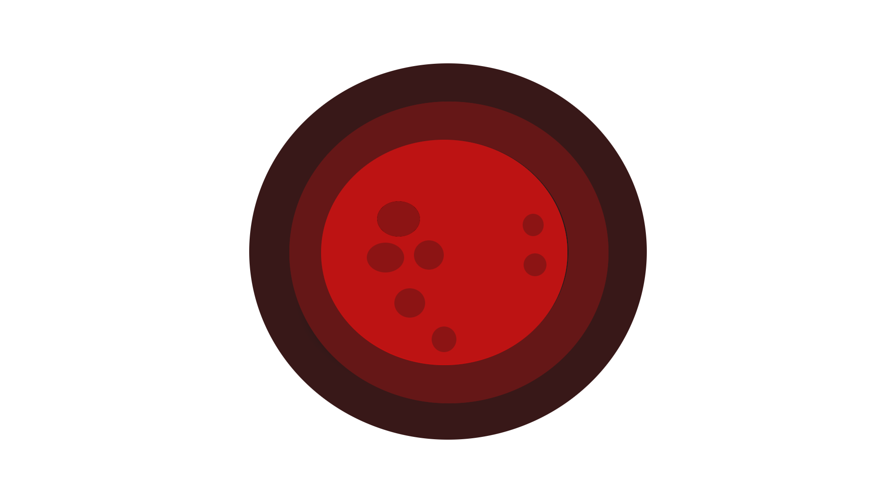
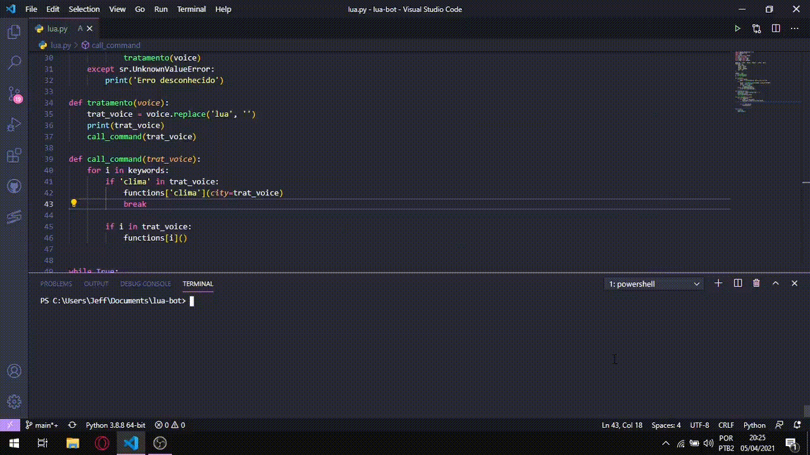
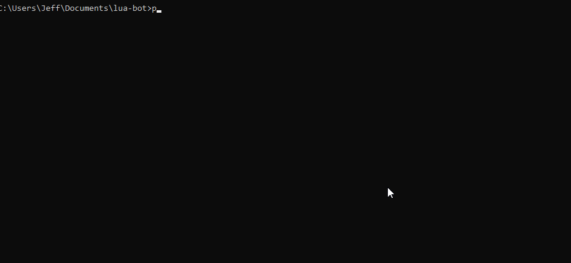

#
<h1 align="center"> LUA

  

</h1>

 

Olá, eu sou a <b>LUA!</b> Sou uma <b>assistente pessoal</b> que foi desenvolvida para <b>melhorar</b> sua <b>vida</b> e o seu <b> workflow</b>

<h1> Libs </h1> 

<h3> Installed by pip </h3>

- Speech_Recognition (https://pypi.org/project/SpeechRecognition/)
- Pyttsx3 (https://pypi.org/project/pyttsx3/)
- Selenium (https://pypi.org/project/selenium/)
- Pyaudio (https://pypi.org/project/PyAudio/)
- WebDriverManager (https://pypi.org/project/webdriver-manager/)
- requests (https://pypi.org/project/requests/)
- BS4 (https://pypi.org/project/bs4/)

#

<h1> Libs do próprio Python: </h1>

- os
- calendar
- datetime

#

<h2> Instação dos requisitos </h2>

 A instalação dos modules é feita pelo comando: pip install -r requirements.txt ou pip3 install -r requirements.txt 

#

<h1> Comandos disponíveis: </h1>

- "lua que dia é hoje"; 📅
- "lua que horas são"; ⌚
- "lua qual é o clima em {cidade}" ☁
- "Qual é o preço do dólar" 💵
- "Qual é o preço do bat" 🦇

Obs: BAT é uma função bonus para quem usa o Brave.

 Obrigado por ler até aqui, espero que tenha compreendido e gostado da lua. Nos veremos em uma próxima atualização! 

